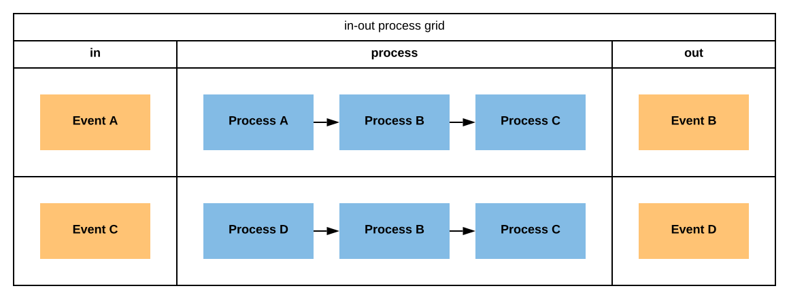
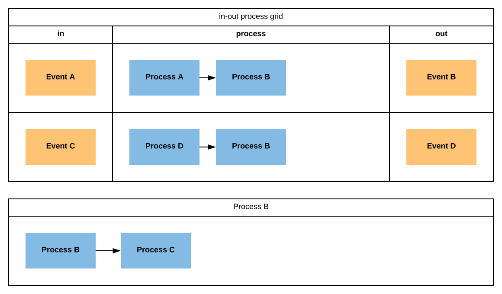

## Designing a microservice

When designing code, it's often hard to focus on work due to all the noise that surrounds the task. Many stakeholders are asking for futures they consider important, specifications are changing and urgent maintenance tasks breaks concentration. This is the reality that can be hard, if not impossible, to change. By breaking down the task of designing a service into stepped roadmap will help maintain focus and result in a more coherent design across domains.

The foundation to a good design of any solution starts by locating the events that defines the solution. A good technique to locate the events are by doing an `eventstorming` session, a methodology developed by Alberto Brandolini, inspired by the DDD community.

Once the events of the microservice has been defined, they must be organized into a process flow. A process is a tree of events with a certain beginning, a root event. Locate the beginning of a process by ordering the events according to when on a timeline they occur. When it becomes apparent where a process begins, and the body of that process has been organized into a tree-like structure of events, then the process flow has formed an aggregation of the domain.

Each process is must be named semanticly correct in relation to the single responsibility the process maintain. Each process is a domain service, the process flow is what we define in the aggregate.

Some processes are repetitive through the model, creating repetitive noise in the model. Create a seperate named context and define the contextual process flow seperatly, and link it by name in the `in-out process grid`.

Each service can often have multiple states of output, due to unexpected failure or other application states. At this stage it is however important to declare an expected successful event to each process. Ignoring all **exceptional events** to the process, an **expected process flow** is defined.

List the name of all processes and describe on one hand the event that triggers the process, and on the other, the expected resulting event. Declare the data body of these events; expected input, and expected output.

When modeling data, we begin with the events. The events are expected to transfer data between processes, so all data will be rooted in the events. It will become apparent that some data sets are repetitive, or clearly has an identity; these data sets are most likely entities. Write a UML diagram of the data model; the events, entities and the value objects.

In parallel to modeling the data model, the infrastructure layer can offer insight to the data model. List all external services that the solution is dependent on. Define each external service as a concrete repository in the UML diagram. Each repository implements different interfaces that describes the available CRUD operations to a resource.

After designing the domain and the infrastructure layer; it is time to design the API layer. In the API layer, the root events defines the input body. Additionally it's important to declare url structure in the API, http methods and other relative states.

once starting to develop, start by develping the master branch, which should reflect the **expected process flow**. After the expected process flow has been developed, develop each exceptional event state into a new branch in the VCS (**V**ersioning **C**ontrol **S**ystem).

## Plan the work

- Staging and dev environments
- Start from the domain and work yourself out

## Make time estimations

- The time estimation is never final until the project is closed for incoming changes
- Each component designed is a card
- Value to highest and lowest cost for each card
