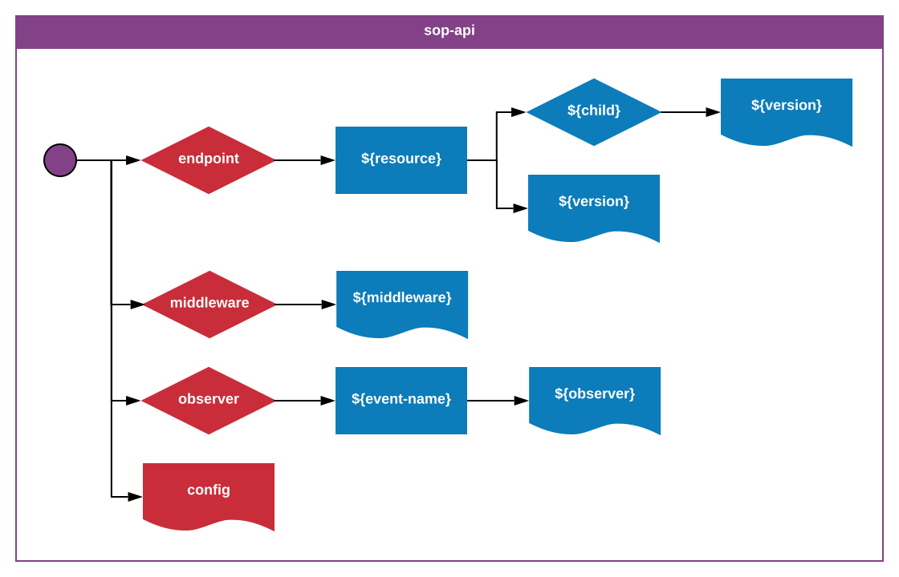

_**sop-api**-1.0.0_  
_Author: Erik Landvall_
# Standard Operating Procedure
### API

This standard defines a folder structure in the `API` layer. The `API` layer is where the application interfaces are defined. This standard is not exclusive, a developer can chose to extend the structure to cover additional definitions.

An optional `endpoint` folder has a nested file structure of child resources, where each resource is defined by the name of the folder, and each file implementation is named by the version number of implemented release. It's part of the standard to dictate that breaking changes to an endpoint must be defined in a new version, that also must be reflected in the router, configured in the `config` file. Endpoints that are deprecated must respond to requests that the implemented version is deprecated, endpoint should describe how the new endpoint can be used, and document relevant mapping, the difference between the input and output.

An optional `middleware` folder, contains shared middleware dispatchers that can be applied to the route of all endpoints. The responsibility of a middleware is to address any pre or post actions related to the endpoint.

An optional `observer` folder, lists folder by event names. All events can be observed by multiple observers, that are listed as siblings under the event named folder. All observers are dependent on the event they are listed under.

The `config` file is responsible for configuring the router and/or attach listeners for the observers to the core eventbus.
