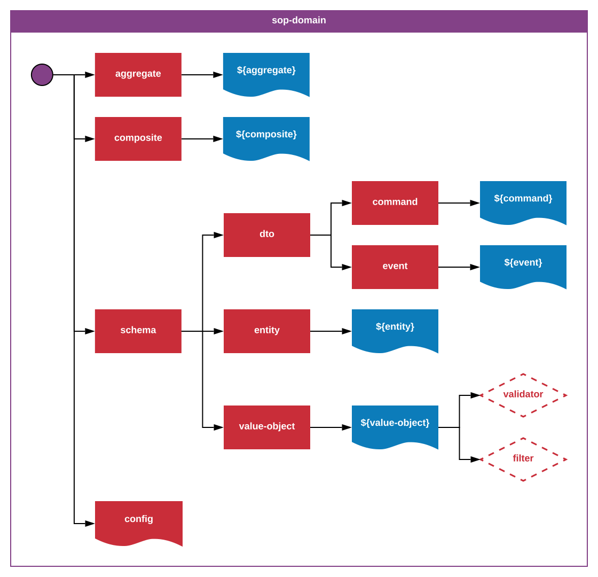

_**sop-domain**-1.0.0_
_Author: Erik Landvall_
# Standard Operating Procedure
### Domain

This standard is strongly correlated with the guidelines that has grown out of the domain driven design community.

The domain is segregated into different layers that has a flat file structure, instead of a tree structure, to be able to reuse components in different contexts. A tree model is designed and defined by logic, not by the source codes file structure.

An `aggregate` is responsible for defining the coherence between compositions that defines the process for atomic events related to an aggregate root. An aggregate root is an entity that is related to the aggregate. An entity can be related to other entities, that is to define a logical tree structure. The aggregates responsibility is to associate verbs, that are defined by the stakeholders, and that are implemented in a composite, with the contextual noun; the aggregate root. An aggregate depends on compositions, where the delegated responsibility of the implementation rests.

The `composite` folder is a flat definition of different domain services. A domain service is related to the verbs defined by the stakeholders. One composite can relate to, or depend on, another composite. A composite is strongly related to the single responsibility principle.

The `schema` folder houses different schema that are divided into sub types:
- `dto`                      - the data transfer model, divided into 2 sub types:
- - `command`                - a query, something that should be done or carried out, present tense
- - `event`                  - something that has happen, past tense
- `entity`                   - correlates with the nouns identified by the stakeholders
- `value-object`             - relates to the adjectives identified by the stakeholders
- - `validator` and `filter` - optional sup folders that defines specific logic related to the contextual adjective defined in there parent scope

The `config` file defines the collected configurations for the domain layer.

---

A global repository should be taken into account for shared resources between different bounded contexts. A linked definition is required where the linked resource is expected to be defined.
