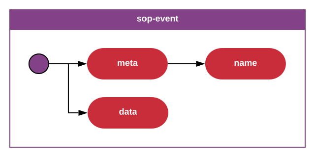

Standard Operating Procedure
Event
sop-event-1.0.0

Author: Erik Landvall

The event structure is defined by 2 layers.

The `meta` layer is responsible for holding all meta related data to the event, such as the name of the event.

The `data` layer is the event message.
