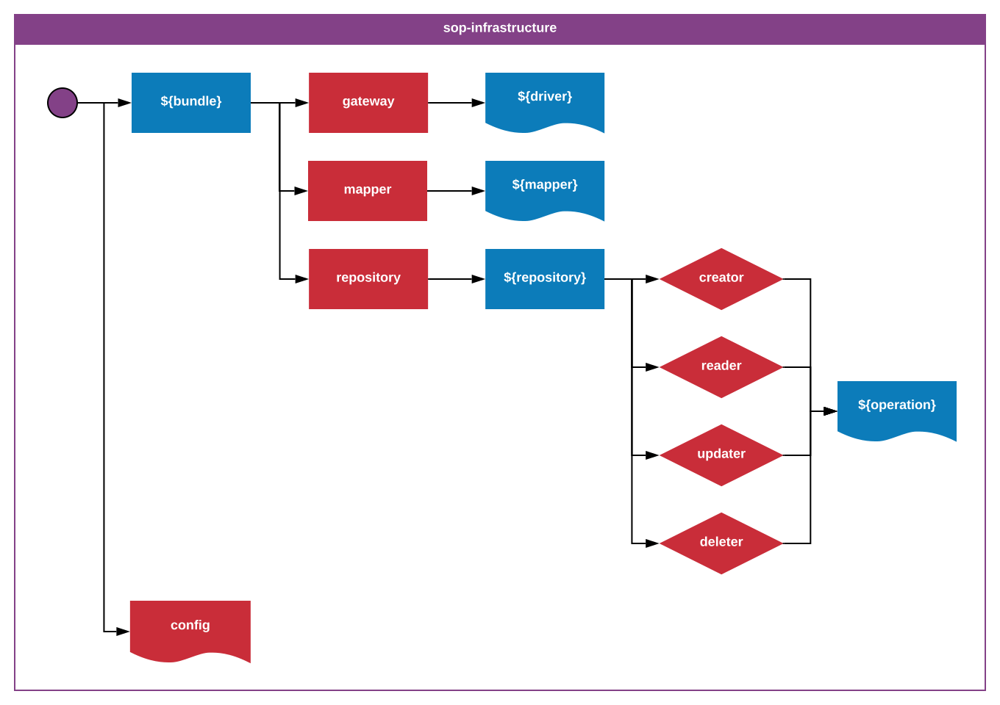

_**sop-infrastructure**-1.1.0_
_Author: Erik Landvall_
# Standard Operating Procedure
### Infrastructure

This standard defines a folder structure for the infrastructure layer. The infrastructure layer is responsible for the logic that is related to external services. The folder structure defines a list of bundles, that semantically correlates with the external service. Each `bundle` has 2 different sub layers:
- `gateway`    - list of drivers necessary to interface with the API of the contextual `bundle`
- `repository` - correlated with external resources, on witch optional reader/writer operations can be defined, though sugested to be seperated in reference to the CQRS pattern.

The segregation of the read and write models, correlates with the responsibility each layer maintain. Operations are expected to honor the single responsibility principle.

An operation often requires a `context mapper` that is responsible for mapping data between the present context and the context defined by the `bundle`, or `bounded context`.

The `config` file defines the collected configurations for all the infrastructure, external services, that the bounded context, that the infrastructure layer partly defines, depends on.
