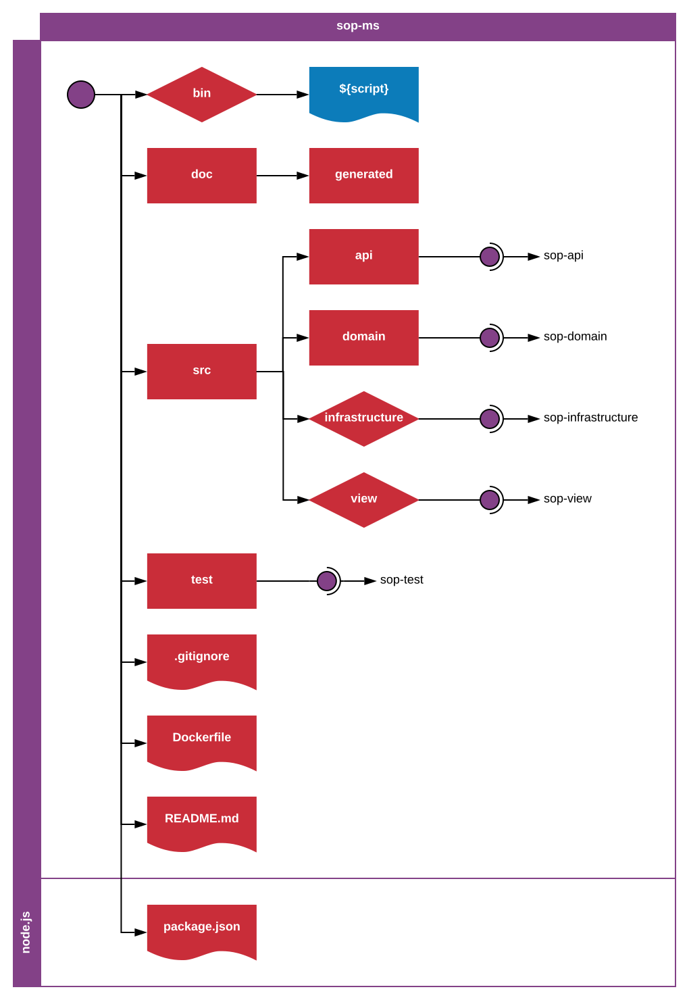

_**sop-ms**-1.0.0_
_Author: Erik Landvall_
# Standard Operating Procedure
### Microservice

A microservice is defined by its context. A microservice has a responsibility that is implied by the context. A microservice is limited by the barriers that is defined by the microservice responsibility.

All developers must use and follow this standard for all microservices. Non conflicting extensions to the standard is allowed when necessity to cover exceptional cases persists.

This standard defines how to structure the code files and folders in a microservice. The responsibility of the standard is to define fundamental levels of a folder structure. Delegated responsibilities are defined in linked standards, described elsewhere.

This standard is expected to be applied in the root folder of a microservice.

The `bin` folder contains all exceptional scripts related to the microservice. The `bin` folder is optional to include in a microservice, depending on necessity in relation to the microservice the developer is developing.

The `doc` folder contains all documentation related to the microservice. The `doc` folder has a child folder called `generated`. The `generated` child folder contains the auto generated documentation that is generated from the written source and test code.

The `src` folder is where all the source code is stored. Sub-folders: `api`, `domain`, `infrastructure`, `view`; are linked to specific standards related to there respective layers. All microservices must implement an API and a Domain model. The Infrastructure and View models are optionals, depending on the necessity of the microservice.

The `test` folder is where test specific code is stored. Linked standard `sop-test` defines an expected test structure.

The `.gitignore` file is required to specify what files we do not want to include in the git repository.

The `Dockerfile` is required to define the microservice expected environment. Without this specification, external dependencies necessary for the application to run, are left undefined.

The `README.md` file must describe the responsibility of the bounded context. If this file is not present, it's hard for a developer to concept what logic is expected in the microsevice.

The `package.json` file is necessary for a node.js application to define dependencies and executable scripts related to the microservice.

---

Attempts to keep the root folder clean, and less noisy, in a microservice is essential for a developers ability to find an initial overview of what the service responsibility is, how the microservice is structured and for a developer to quickly be able to understand the core behavior of the microservice.
