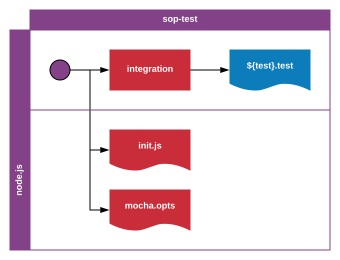

Standard Operating Procedure
Test
sop-test-1.0.0

Author: Erik Landvall

This standard defines an expected test file structure.

The `integration` layer is expected to list a test case for each endpoint. Each test file must be declared with the suffix `test`.
