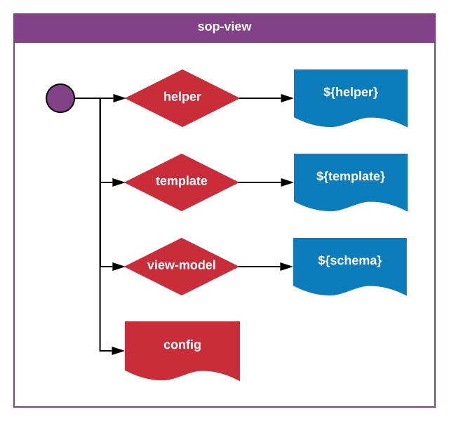

_**sop-view**-1.0.0_
_Author: Erik Landvall_
# Standard Operating Procedure
### View

The optional `helper` folder is a flat file structure of helpers related to the template engine.

The optional `template` folder lists template scripts necessary for the view to compose the output.

The optional `view-model` folder lists schemas that are important for validation, before the view model is used by the template engine.

The `config` file is primarily responsible for attaching listeners and configure view related actors.
